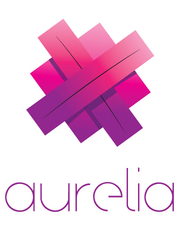
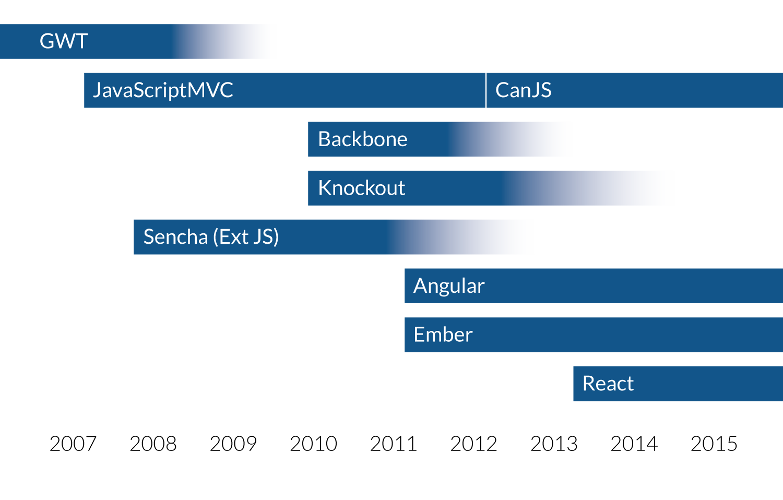
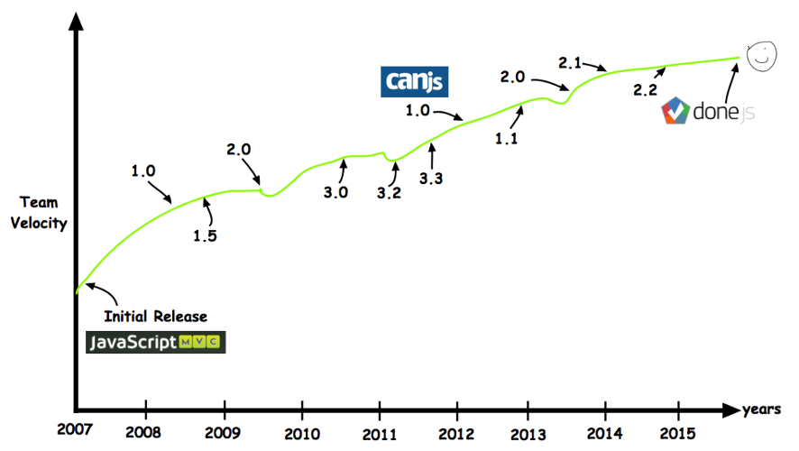

title: 5 Powerful & Non-popular Frameworks
author:
  name: Cherif BOUCHELAGHEM
  twitter: cherif_b
  github: cherifGsoul
  url: http://cherifbouchelaghem.com
output: index.html
controls: false
theme: theme

--

# 5 Powerful & Non-popular Frameworks

--

##
Knockout is a JavaScript library that helps you to create rich, responsive display and editor user interfaces with a clean underlying data model. Any time you have sections of UI that update dynamically (e.g., changing depending on the user’s actions or when an external data source changes), KO can help you implement it more simply and maintainably.
* Trés légére
* Facile à intégrer dans une application existante
* Observables
* Computed observables
* Declarative binding
* HTML templating
* Support de differents navigateurs même IE6

--
## CujoJS

CujoJS is an architectural toolkit for building highly modular, maintainable web applications that are easy to test and refactor, with zero framework lock-in.

Boite à outil plûtot qu'un framework monolithique qui contient:
* colajs: two-way binding
* cramjs: AMD et commonJS bundler
* curljs: Module loader qui peut charger AMD, CommonJS 1.1, CSS, HTML/text et même les anciens scripts
* jiffjs: JSON Patch, implémentation de RFC6902 
* meldjs: AOP pour JS avec before, around, on, afterReturning, afterThrowing, after advice, and pointcuts.
* msgjs: Message oriented programming
* polyjs: ES5 Polyfill
* restjs: Un client RESTful pour JS
* whenjs: Une implémentation solid de Promises et de when() plus autres fonctionalités pour Async JS
* wirejs: Un léger JS IOC container

--
##

Aria Templates (aka AT) is an application framework written in JavaScript for building rich and large-scaled enterprise web applications. It is being developed since 2009 by Amadeus for its professional products. It has been designed for web apps that are used 8+ hours a day, and that need to display and process high amount of data with a minimum of bandwidth consumption.

* Permet une gestion avancer de classes et de la programmation orientée objet
* Template engine
* Performance
* Data binding


--
##

is a next gen JavaScript client framework for mobile, desktop and web that leverages simple conventions to empower your creativity.
* Forward-thinking: Ecrit en ES6 et support les Web Components
* Two-Way Databinding: avec des objets observables composer de getters and setters
* Routing & UI Composition
* Dependency Injection (DI)
* MV* with Conventions: qui permet de gagner du temps surtout pour le travail dans une équipe
* Testable
--
##

CanJS is a JavaScript library that makes
developing complex applications simple and fast.
Easy-to-learn, small, and unassuming of your
application structure, but with modern features
like custom tags and 2-way binding. Creating
apps is easy and maintainable.

--
## History
##
--
## History
##
--
## built with CanJS
* HP.com (http://www.hp.com/country/us/en/uc/welcome.html)
* Apple (http://www.apple.com/shop/buy-mac/macbook)
* cars.com (https://www.cars.com/)
* Mindjet (https://www.mindjet.com/)
* SamsClub (http://m.samsclub.com/)
* BrightRoll (http://www.brightroll.com/)

--
### can.Construct.extend(s,p);
Provides a way to easily use the power of prototypal inheritance without worrying about hooking up all the particulars yourself. Use can.Construct.extend to create an inheritable constructor function of your own.


```javascript
var Person = can.Construct.extend({
	init: function (name) {
		this.name = name;
	},
	sayHello:function(to) {
		return "Hello " + to;
	}

});

var cherif = new Person("Cherif"); //init gets called

cherif.name; // -> cherif

cherif.sayHello("World"); // -> Hello World

cherif instanceof Person; // ->true

```

--
### new can.Map(data)

Create observable objects.


```javascript
var person = new can.Map({
	firstname:'Cherif',
	lastname: 'BOUCHELAGHEM',
	fullname:can.compute() { //can be a comuted value (will see compute later)
		return this.attr('firstname') + ' ' + this.attr('lastname');
	},
	hobbies:['JS','bball','football']
});

person.attr('name'); //-> 'Cherif'

//listen to changes
person.bind('name',function(ev,newVal,oldVal){
	newVal //-> 'Khaled'
	oldVal //-> 'Cherif'
});

//change the attribute
person.attr('name','Khaled'); // fires an event with the name of attribute in this case "name"
```

--
### new can.List(data)

Create an observable array-like object.


```javascript
var hobbies = new can.List(['JS']);

hobbies.attr(0); //-> 'JS'

hobbies.bind ('add',function(ev,items,index){
	items //-> ['bball','football']
	index //-> 1
});

hobbies.push('bball','football'); // fires "add" event
```

--
### can.compute(data)

Create an observable value.

```javascript
var age = can.compute(30);

age(); //-> 30

age.bind('change', function ( ev,newVal,oldVal ){
	newVal //-> 31
	oldVal //-> 30
});

age(31); //fires "change" event
```

--
### can.compute(getter)

Creates a compute from a value and optionally specifies how to read, update, and listen to changes in dependent values. This form of can.compute can be used to create a compute that derives its value from any source.


```javascript
var hobbies = ["JS, bball, football"]

var info = can.compute(function(){
	return person.attr("name")+" a "+age()+	" ans et aime: "+hobbies.join(', ')
});

info() //-> "Cherif a 31 ans et aime JS, bball, football"

info.bind('change',function(ev,newVal,oldVal){
	newVal //-> "Cherif a 33 ans et aime JS, bball"
});

hobbies.pop(); //delete the last element from the list fires "change" event
```

--
### can.Model.extend(s,p)
makes connecting to a JSON REST service really easy, 
in other words, it really helps to do CRUD operations

```javascript
var Task = can.Model.extend({
	findAll: "GET /tasks",
	findOne: "GET /tasks/{id}",
	create: "POST /tasks",
	update: "PUT /tasks/{id}",
	destroy: "DELETE /tasks/{id}"
},{});

// retreive All tasks from the server 
// returns Deferred, the callback to process the Deferred
Task.findAll ({due:"today"},function(tasks){});

// retreive a task from the server with id 51
// returns Deferred, the callback to process the Deferred
Task.findOne ({id: 51},function(task){});
```
--
### can.Model.extend(s,p)

```javascript
var task = new Task({name:"Apprendre CanJS."}); // create task

task.save(function(){ //save the task the callback to process on response
	task.attr("name","Apprendre JS et CanJS.") // modify the saved task
	.save(function(){ // save the last modification
		task.destroy() // delete the task 
	})
});
```

can.Model is a can.Map.

--
### can.Model.List(s,p)

A list connected to can.Model's CRUD abilities.


```javascript
var tasks= new Task.List();

can.each(tasks,function(task){
});

//custom model list
Task.List = can.Model.List.extend({
	Map: Task
},{});
```

--
### can.route(route,defaults)

Manage browser history and client state by synchronizing the window.location.hash with a can.Map.

```javascript

//defining route can.route('route'[,defaults])
route(':page', { page: 'home' });
route(':page/:slug', { slug: null });
route(':page/:slug/:action', { slug: null, action: null });

//listen to changes
can.route.bind("change", function(){
	if(can.route.attr('page') == "tasks"){
		var id = can.route.attr('id');
		if( id ) {
			Task.findOne({id: id});
		}
	}
});
```

--
### can.Control.extend( s, p )
Create organized, memory-leak free, rapidly performing, stateful controls with declarative event binding. Use can.Control to create UI controls like tabs, grids, and context menus, and organize them into higher-order business rules with can.route. It can serve as both a traditional view and a traditional controller.


```javascript
var Tabs = can.Control.extend({
	init: function( el,options ) {
		// Afficher le premier onglet
	},
	'li click': function( el, ev ) {
		// Masquer les autes onglet
		// Afficher l'onglet selectioné
	},
	'{route} change':function(route,ev) {
		//change the DOM based on the client state
	}
});

new Tabs('#tabs');
```

--
### can.mustache /can.stache

Logic-less mustache templates with live binding when used with can.Maps.

```javascript
{#if devs.length}}
	{{#each devs}}
		<li>{{name}}</li>
	{{/each}}
{{else}}
	<li>pas de développeurs</li>
{{/if}}

$('#my-el').can.view('devs.mustache',{
	devs: new can.List([{name:'Khaled'}])
});
```

Mustache and Handlebar templates are compatible with can.mustache/can.stache.

--
### can.view.tag(tagName,tagHandler)
Register custom behavior for a given tag.

```javascript
can.view.tag('ui-datepicker',function(el,tagData){
	$(el).datepicker();
});
```

Getting values from the template

```javascript
can.view.tag('ui-datepicker',function(el,tagData){
	$(el).datepicker({format: tagData.scope.attr('format')});
});
var template = can.mustache("<ui-datepicker></ui-datepicker>")
template({format: "dd/mm/yy"})
```
--

### can.view.tag(tagName,tagHandler)

Responding to changing data

```javascript
can.view.tag('ui-datepicker',function(el,tagData){
	var formatCompute = tagData.scope.compute("format"), //yes it's a compute
    changeHandler = function(ev, newVal){
        $(el).datepicker("option","format", newVal});
      }
  	formatCompute.bind("change",changeHandler);
});
var template = can.mustache("<ui-datepicker></ui-datepicker>")
template({format: "dd/mm/yy"})
```
--

### can.view.attr(attrbuteName,attributeHandler)

Registers custom behavior when attribute name is found in a template.

```javascript
can.view.attr("tooltip", function( el, attrData ) {
  var updateTooltip = function(){
    $(el).tooltip({
      content: el.getAttribute("tooltip"), 
      items: "[tooltip]"
    });
  };
  
  $(el).bind("attributes", function(ev){
    if(ev.attributeName === "tooltip") {
      updateTooltip();
    }
  });
  
  updateTooltip();
        
});
```


-- 
## can.Component.extend(p)

```javascript
can.Component.extend({
	tag:"ui-panel", //can.view.tag
	template: "{{#if active}}<content>...", // can.mustache / can.stache
	viewModel: { // viewModel or scope is a can.Map
		active: false,
		....
	},
	helpers: {} //mustache / stache helpers
	events: {	// can.Control
		inserted: function(){...}
	}
});
```
```javascript
<ui-tabs>
	{{#each foodTypes}}
		<ui-panel title='title'>
			{{content}}
		</ui-panel>
	{{/each}}
</ui-tabs>
```

--
## 2 way binding

Create widgets that use a template, a view-model, and custom tags.


```javascript
var Voyage= can.Map.extend({
	voyageTemp:function(){
		return this.attr('dist')/110 //km/h
	}
});
var alger=new Voyage({
	dist:563.67
});

var template=can.view.mustache('<p><lable>distance:</label>\
								<input can-value="dist"/></p>\
								<p>Temp:{{voyageTemp}}</p>'
								);
$('#vo').html(template(alger));
```


--
### Plugins (Yes official plugins)
* Define: can.Map (Must see)
* Validations: can.Map
* Getter / Setter: can.Map (Deprecated)
* Backup / Restore: can.Map
* Super: can.Construct
* Queue: can.Map
* Delegate: can.Control
* PushState: can.route
* Fixtures: RESTful server simulation
* LazyMap: can.Map
* Events: Events for your JS object
* jQuery Plugin: can.Control as jQuery Plugin
* Route Control: can.Control as router (anti-pattern)

--
#Demo

--
#useful links
* canjs official website http://canjs.com/
* canjs official repo https://github.com/bitovi/canjs
* open source bitovi components https://github.com/bitovi-components/
* CanJS plugin and stuffs https://github.com/canjs/
* bitovi website http://www.bitovi.com/
* bitovi blog http://www.bitovi.com/blog/

--
#Questions